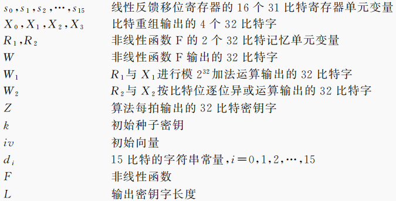

# VSCode配置

`.vscode`为vscode配置文件夹  
编译调试：`F5`  
编译运行：`Ctrl+F5`  
仅编译：`Ctrl+Shift+B`

---
# 参考

主要参考国标文档，具体如下：  

* [GB/T 33133.1-2016](http://c.gb688.cn/bzgk/gb/showGb?type=online&hcno=8C41A3AEECCA52B5C0011C8010CF0715) 信息安全技术 祖冲之序列密码算法 第1部分：算法描述
* [GB/T 33133.2-2021](http://c.gb688.cn/bzgk/gb/showGb?type=online&hcno=5D3CBA3ADEC7989344BD1E63006EF2B3) 信息安全技术 祖冲之序列密码算法 第2部分：保密性算法
* [	GB/T 33133.3-2021](http://c.gb688.cn/bzgk/gb/showGb?type=online&hcno=C6D60AE0A7578E970EF2280ABD49F4F0) 信息安全技术 祖冲之序列密码算法 第3部分：完整性算法

---
# 关于数据类型和命名规则
### 数据类型
使用了`uint8_t`,`uint32_t`,`uint64_t`等数据类型，其中u表示unsigned,数字表示位数，_t表示由typedef定义。  
这些数据类型在stdint.h中定义，源码如下：
```C
/* 7.18.1.1  Exact-width integer types */
typedef signed char int8_t;
typedef unsigned char   uint8_t;
typedef short  int16_t;
typedef unsigned short  uint16_t;
typedef int  int32_t;
typedef unsigned   uint32_t;
__MINGW_EXTENSION typedef long long  int64_t;
__MINGW_EXTENSION typedef unsigned long long   uint64_t;
```
其实就是我们熟悉的char、int之类，使用这些typedef变量是为了方便区别长度。

### 变量命名
变量的命名主要来自国标文档的算法描述部分，具体如下：


---
# 关于可处理文本长度
开发环境下默认为8192个字符。如有修改需求，可直接修改`ZUC_CLI.cpp`的`buffer_size`常量。  
``` C++
const int buffer_size = 8192;
```

---
# 关于命令行和文件输入输出
在命令行输入输出下，使用`scanf()`进行输入，一次只能输入一行。而且输入数据后会带一个`\n`，需要额外处理。  
而在文件输入输出下，使用`fread()`进行输入，一次可输入多行，并且没有`\n`的问题（只要用户不主动多敲一个回车）。    
综上，**建议使用文件模式进行输入输出**。

<!--  
---
# 关于图形化界面
使用Qt开发，详见[这里](https://github.com/Jinvic/IS_experiment/tree/main/Tiger%20Hash/Qt)。
 -->

---
# 待办事项
* ~~ZUC算法部分（已完成）~~
* ~~输入输出（命令行，文件）（已完成）~~
* ~~命令行界面交互设计（已完成）~~
* Qt图形化界面


